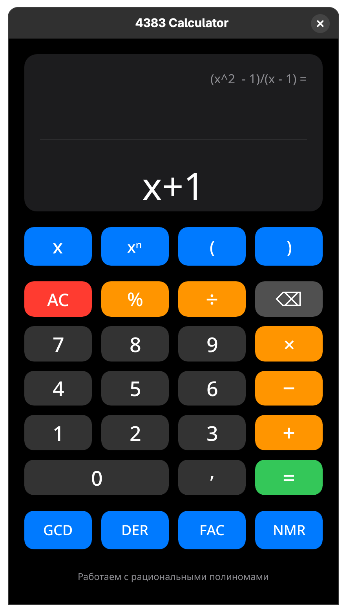

# colloquium_dmiti

Цель [коллоквиума](https://docs.google.com/document/d/1Dv_6AIhxg_3ezu6VMcEnMpyfRzgym9l8PmE4ULGfjgM/edit?tab=t.0) - создать систему компьютерной алгебры

### Архитектура проекта

Проект имеет следующую структуру:

```
.
├── CMakeLists.txt
├── src
│   ├── api
│   │   └── calculator
│   │       ├── calculator.cpp
│   │       └── calculator.hpp
│   ├── main.cpp
│   ├── modules
│   │   ├── numbers
│   │   │   ├── integer
│   │   │   │   ├── integer.cpp
│   │   │   │   └── integer.hpp
│   │   │   ├── natural
│   │   │   │   ├── natural.cpp
│   │   │   │   └── natural.hpp
│   │   │   └── rational
│   │   │       ├── rational.cpp
│   │   │       └── rational.hpp
│   │   └── polynomial
│   │       ├── polynomial.cpp
│   │       └── polynomial.hpp
│   └── ui
└── tst
    ├── CMakeLists.txt
    ├── test_calculator.cc
    ├── test_integer.cc
    ├── test_natural.cc
    ├── test_polynomial.cc
    └── test_rational.cc
```

Рассмотрим ее по порядку.

## src 
Содержит основную логику проекта:
- модули
- апи модулей
- интерфейс

### src/modules 
Содержит реализацию модулей.
Модули разделены по блокам:
- натуральные числа
- целые числа
- рациональные числа
- полиномы над рациональными числами

Каждый блок содержит `*.hpp` и `*.cpp` файлы с объявлением класса блока и его реализацией соответственно.

- `class Naturals` - Класс натуральных чисел. Использует строку цифр и старший разряд.
- `class Integer` - Класс целых чисел. Использует натуральное число и знак.
- `class Rational` - Класс рациональных чисел. Использует целое число в качестве числителя и натуральное в качестве знаменателя.
- `class Polynomial` - Класс рациональных полиномов. Использует структуру данных "красно-черное дерево" (aka std::map) для хранения рациональных коэфициентов. Это необходимо для эффективной работы с разряженными данными (например `x^n + 1`, где `n` большое число). Максимальная степень многочлена ограничена `INT_MAX = 2^31 - 1`.

### src/api
Содержит апи для работы с рациональными полиномами. Получает на вход выражение в виде строки (например `(x^2 - 1)/(x - 1)`) и возвращает посчитанное выражение (например `1 * x^1 + 1`).

### src/ui
Содержит пользовательский интерфейс. Реализован при помощи `Qt6`. Формирует запрос к апи и отображает ответ.

Пример работы:


Важно отметить, что калькулятор работает именно с рациональными полиномами, а это значит, что `GCD(5, 10)` может быть равен любому рациональному числу. Договоримся, что ответ будет равен `1`.

## tst
Содержит более 180 тестов для проверки работы блоков и апи. Все тесты проходят успешно.

### Сборка и запуск проекта

Перед началом работы необходимо убедиться в том, что у вас установлен `Qt6`, иначе будет собрана тестовая версия без UI. 

Способы установки приводить не будем, так как это может сильно зависеть от вашей системы (по этой же причине отсутствует исполняемый файл). Искренне надеемся, что наш пользователь сможет разобраться с установкой.


Далее необходимо выполнить следующие действия:
1. Создать директорию для сбоки в корне проекта и перейти в нее

```bash
mkdir build
cmake -B build
cd build
```

2. Создать Makefile
```bash
cmake
```

3. Собрать исполняемый файл
```bash
make
```

4. Запустить программу
```bash
./app
```

Или же просто
```bash
cmake && make && ./app
```

### Запуск тестов

Чтобы запустить тесты необходимо собрать исполняемый файл и выполнить команду
```bash
ctest
```

При разработке вас будут интересовать не все тесты, их можно отфильтровать регулярным выражением
```bash
ctest -R "NaturalTests.CreateDefault"
```

Или вместе со сборкой
```bash
cmake && make && ctest -R "NaturalTests.CreateDefault"
```

Возможный вывод:
```bash
Test project /colloquium_dmiti/build
    Start 1: NaturalTests.CreateDefault
1/2 Test #1: NaturalTests.CreateDefault .......   Passed    0.00 sec
    Start 2: NaturalTests.InvalidString
2/2 Test #2: NaturalTests.InvalidString .......   Passed    0.00 sec

100% tests passed, 0 tests failed out of 2

Total Test time (real) =   0.01 sec
```

Вывод логов проваленных тестов:
```bash
ctest --rerun-failed --output-on-failure
```
